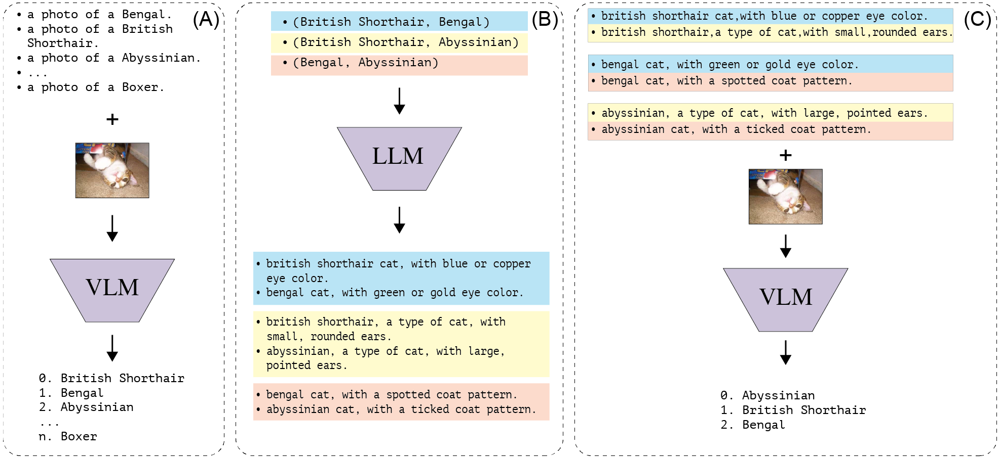

# Follow-up Differential Descriptions

## Reproducing the results

Install the requirements in the `requirements.txt` file.
To install the `clip` module, follow the instructions in the [original repository](https://github.com/openai/CLIP/tree/main).

Follow the instructions in [Dataset_preparation.md](./Dataset_preparation.md) to prepare the datasets.

Set the `DATA_ROOT` and `PROMPT_ROOT` variables in the `./create_results.sh` and run the script to reproduce the results reported in Table 1.

To reproduce the results in Table 2, please use the code in `./analysis_exp` directory of this repo.
